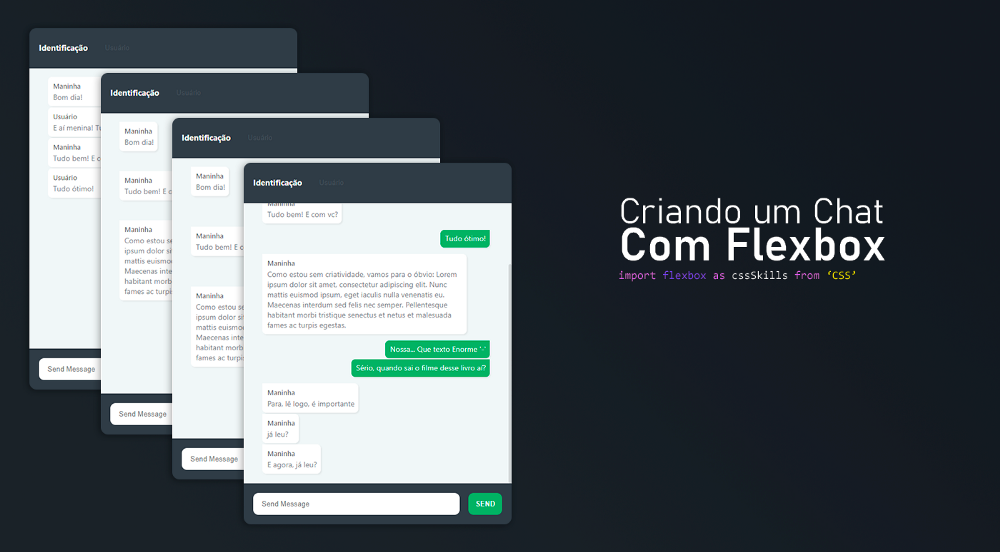

# Chat-App-Design
Demonstração de design de um app de chat. Este projeto não conta com o backend, mas algumas sinalizações de como seria implementado socket.io já são apresentadas.

Um artigo completo foi publicado no medium, explicando todas as etapas da construção desse chat, dê uma olhada [Clicando Aqui!]<https://medium.com/@filipedainezesouza/criando-um-chat-com-pouco-css-92f2ec0222d1>
